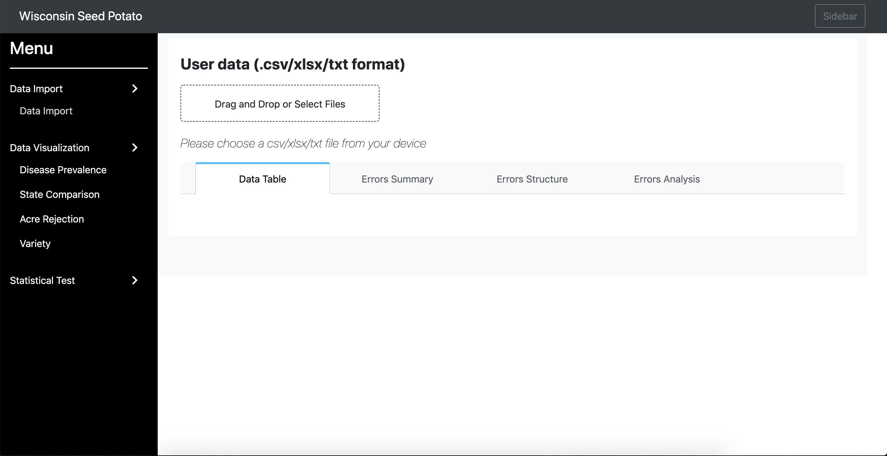
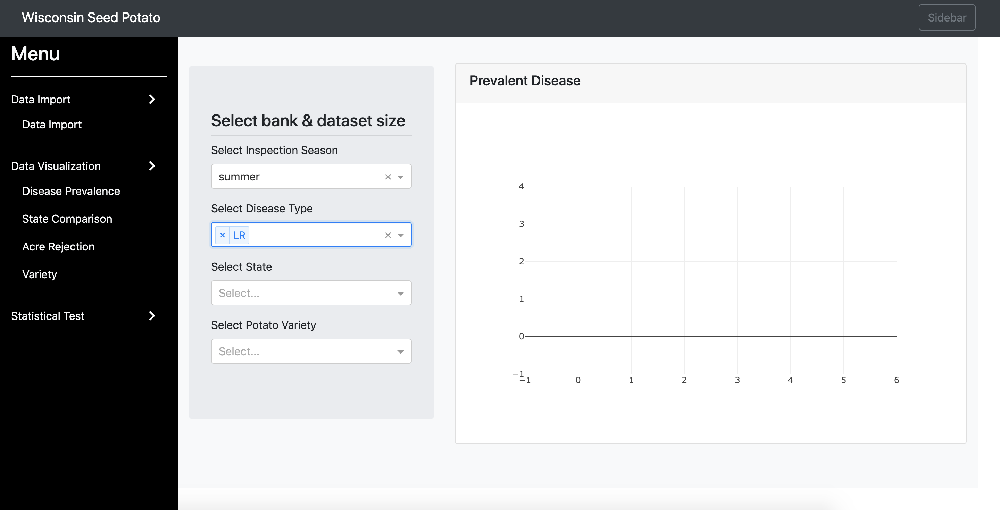
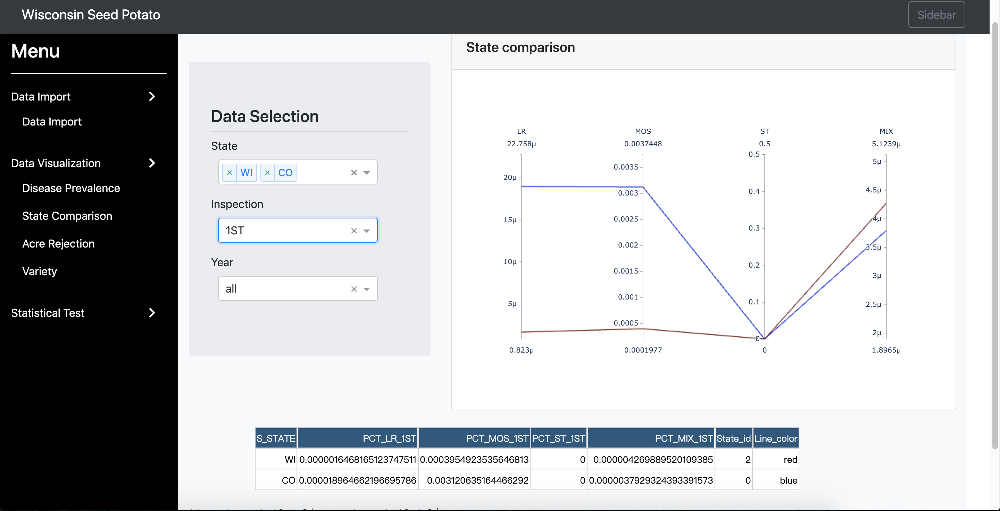
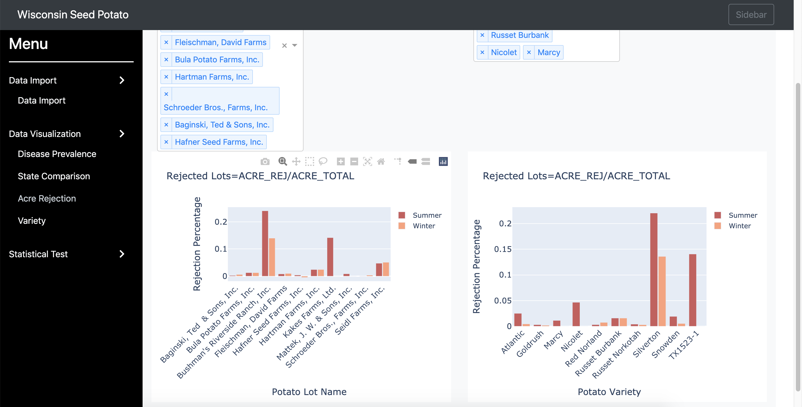
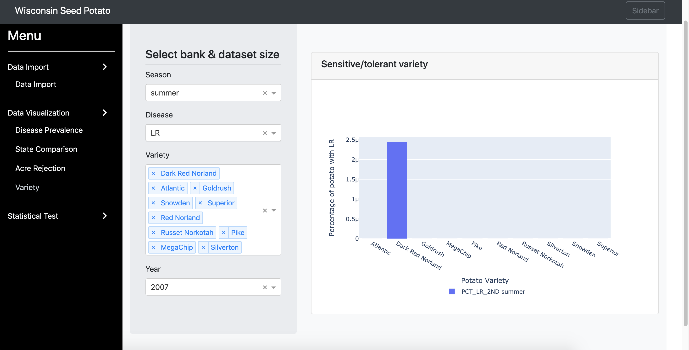
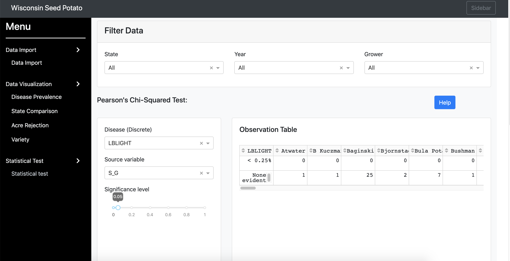

# Potato-Seed-Cert Documentation
Potato-Seed-Cert is a dashboard for visualizing code for the potato seed certification database.
Examining the health condition of patato growth is important to potato farmers. 
We classify the given data based on state, disease type, season and potato type. Plot line chart and bar chart to visulize the health condition of potatos.

The following shows the hirearchy of the website:
- [Potato-Seed-Cert Documentation](#potato-seed-cert-documentation)
  - [Home Page](#home-page)
      - [Data Import Section](#data-import-section)
      - [Data Visulization Section](#data-visulization-section)
        - [Disease Prevalence](#disease-prevalence)
        - [State Comparison](#state-comparison)
        - [Acre Rejection](#acre-rejection)
        - [Variety](#variety)
      - [Stastical Test](#stastical-test)
- [Feedback](#feedback)

## Home Page
The home page contains two sections: 1) for uploading files and 2) for fitting the machine-learning models.

#### Data Import Section
* There is only one file required(data file).
    * Data file should be a csv/xlsx/txt file that contains potato health condition
* You can upload one file at a time from your local device. 
* Note that the files will be removed everytime when you reclick the Data Import tab.

#### Data Visulization Section
* There are 4 kinds of analysis implemented in the section: 
    * Disease Prevalence
    * State Comparison
    * Acre Rejection
    * Variety
* Each analysis contains bar plot/line plots showing potatoes' health condition based on different classification criterias
    
                                                             

##### Disease Prevalence
* The disease prevalence page contains 4 drop down choices:
  * Insepection Season: Summer/Winter
  * Disease Type
  * State
  * Potato Variety
* After choosing the 4 elements above, it will generate a line plot. The x-axis is Year, and y-axis is Percentage of potato with the disease type you chose before.
* Note that all information are given in the data you uploaded in the first section.

##### State Comparison
* The state comparison page contains 3 drop down choices:
  * State
  * Inspection: 1ST/2ND
  * Year
* After choosing the 3 elements above, it will generate a line plot. It compares the susceptibility of potatoes to different diseases in different states.
*  Note that all information are given in the data you uploaded in the first section.

##### Acre Rejection
* The acre rejection page contains two bar plots based on different classification criterias:
  * Potato Lot Name
  * Potato Variety
* The y-axis of each bar plot is Rejection Percentage(ACRE_REJ/ACRE_TOTAL). The x-axis is different potato lot name or potato variety. For each potato lot name/potato variety, it shows two bars -- one for summer and one for winter.
*  Note that all information are given in the data you uploaded in the first section.

##### Variety
* The variety page contains 4 drop down choices:
  * Season: Summer/Winter
  * Disease 
  * Variety
  * Year
* After choosing the 4 elements above, it will generate a bar plot. The x-axis is different kinds of potato variety, and y-axis is Percentage of potato with the disease type you chose before.
*  Note that all information are given in the data you uploaded in the first section.

#### Stastical Test
* The stastical test page contains two tests result:
  * Pearson's Chi-Squared Test
  * Anova Test
* For each test section, there are 3 drop down choices:
  * Disease(Discrete)
  * Source variable
  * Significant level: From 0 to 1
* After choosing the 3 elements above, it will generate a result table.
* Note that the files will be removed everytime when you reclick the Data Import tab.

# Feedback
* Issues reports are encouraged through the [GitHub Issue Tracker](https://github.com/solislemuslab/bioklustering/issues).
* Feedback is always welcome via the following [Google Form](https://forms.gle/SUYQ6X3WNotpQphj6).

