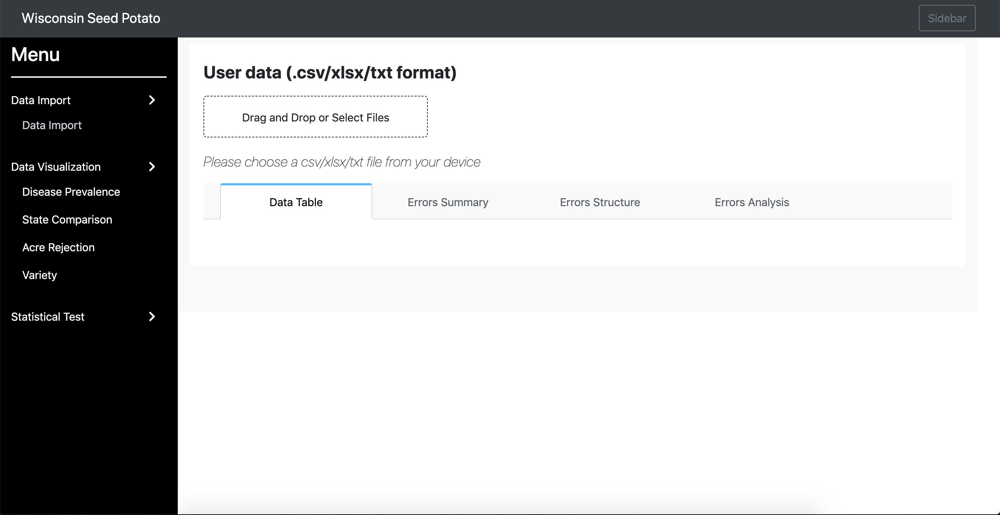
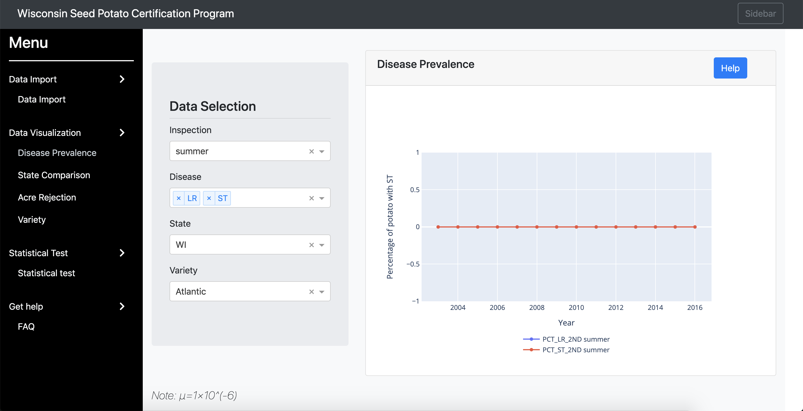
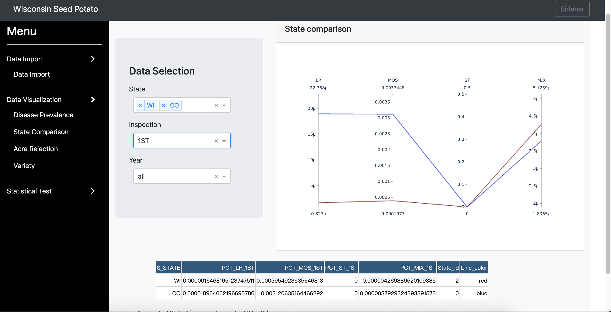
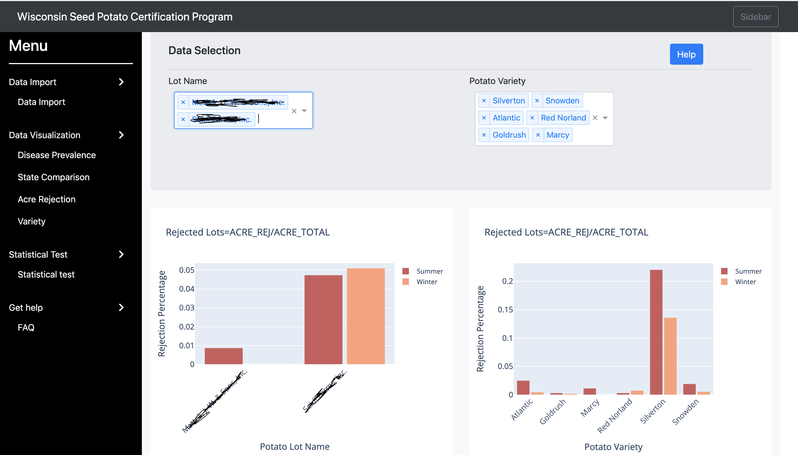
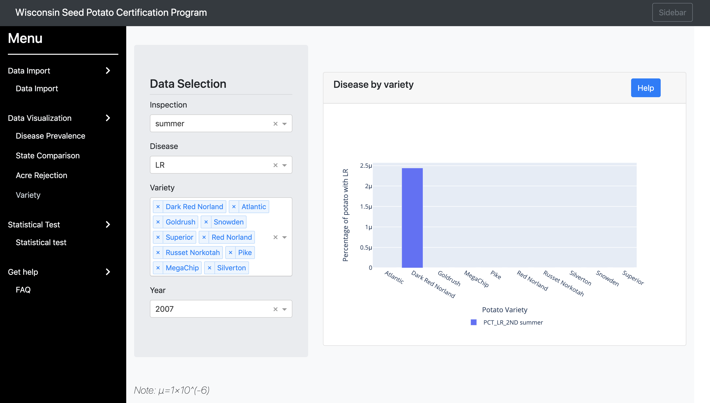
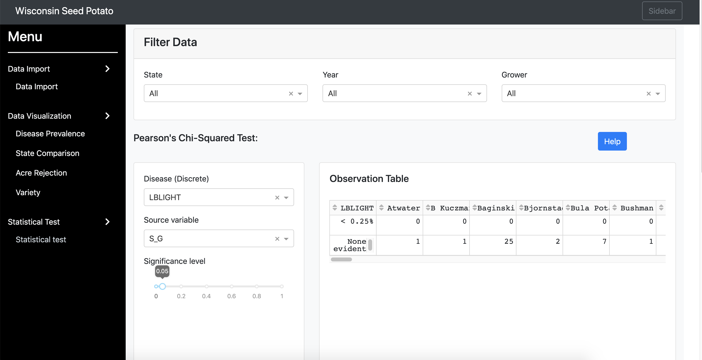

# Potato-Seed-Dashboard Documentation
`Potato-Seed-Dashboard` is an online bioinformatics tool for visualizing and analyzing the potato seed certification database.
We classify the data based on state, disease type, season and potato.

The following shows the hierarchy of the website:
- [Potato-Seed-Dashboard Documentation](#potato-seed-dashboard-documentation)
  - [Home Page](#home-page)
      - [Data Import Section](#data-import-section)
      - [Data Visualization Section](#data-visualization-section)
        - [Disease Prevalence](#disease-prevalence)
        - [State Comparison](#state-comparison)
        - [Acre Rejection](#acre-rejection)
        - [Variety](#variety)
      - [Statistical Test](#statistical-test)
- [Feedback](#feedback)

## Home Page
The home page contains three sections: 1) "Data Import" for uploading files, 2) "Data Visualization" for creating plots, and 3) "Statistical Test" for fitting statistical models.

#### Data Import Section
* There is only one file required (the database as a spreadsheet).
    * Data file should be a csv/xlsx/txt file that contains seed potato certification data
* You can upload one file at a time from your local device. 
* In the current version of the dashboard, the files will be removed everytime when you reclick the Data Import tab. As future work, we are implementing a user-password login to allow the data to be stored in the protected environment in the servers.

#### Data Visualization Section
* There are 4 kinds of visualization plots implemented in this section: 
    * Disease Prevalence
    * State Comparison
    * Acre Rejection
    * Variety
* Each analysis contains bar plot/line plots showing potato health condition based on different classification criteria.
    
                                                             
##### Disease Prevalence
* The disease prevalence page contains 4 drop down choices:
  * Inspection Season: Summer/Winter
  * Disease Type
  * State
  * Potato Variety
* After choosing the 4 elements above, it will generate a line plot. The x-axis is Year, and y-axis is Percentage of potato with the disease type you chose before.

##### State Comparison
* The state comparison page contains 3 drop down choices:
  * State
  * Inspection: 1ST/2ND
  * Year
* After choosing the 3 elements above, it will generate a line plot. It compares the susceptibility of potato to different diseases in different states. Each line corresponds to a state, and each axis corresponds to a disease type.

##### Acre Rejection
* The acre rejection page contains two bar plots based on different classification criterias:
  * Potato Lot Name
  * Potato Variety
* The y-axis of each bar plot is Rejection Percentage (ACRE_REJ/ACRE_TOTAL). The x-axis is different potato lot name or potato variety. For each potato lot name/potato variety, it shows two bars -- one for summer and one for winter.

##### Variety
* The variety page contains 4 drop down choices:
  * Season: Summer/Winter
  * Disease 
  * Variety
  * Year
* After choosing the 4 elements above, it will generate a bar plot. The x-axis is different kinds of potato variety, and y-axis is Percentage of potato with the disease type you chose before.

#### Statistical Test
* The statistical test page contains two types of methods:
  * Pearson's Chi-Squared Test
  * Anova Test
* You need to filter the data first based on State, Year and Grower.
* For each test section, there are 3 drop down choices:
  * Disease
  * Source variable
  * Significant level: From 0 to 1
* After choosing the 3 elements above, it will generate a result table.

# Feedback
* Issues reports are encouraged through the [GitHub Issue Tracker](https://github.com/solislemuslab/bioklustering/issues).
* Feedback is always welcome via the following [Google Form](https://forms.gle/SUYQ6X3WNotpQphj6).

