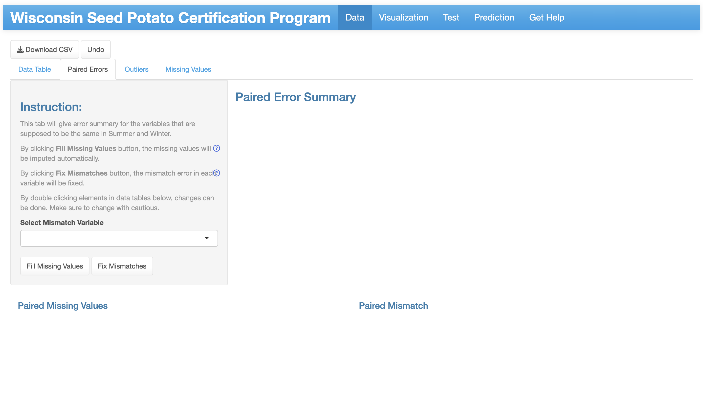
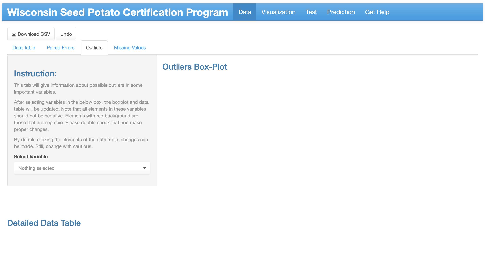
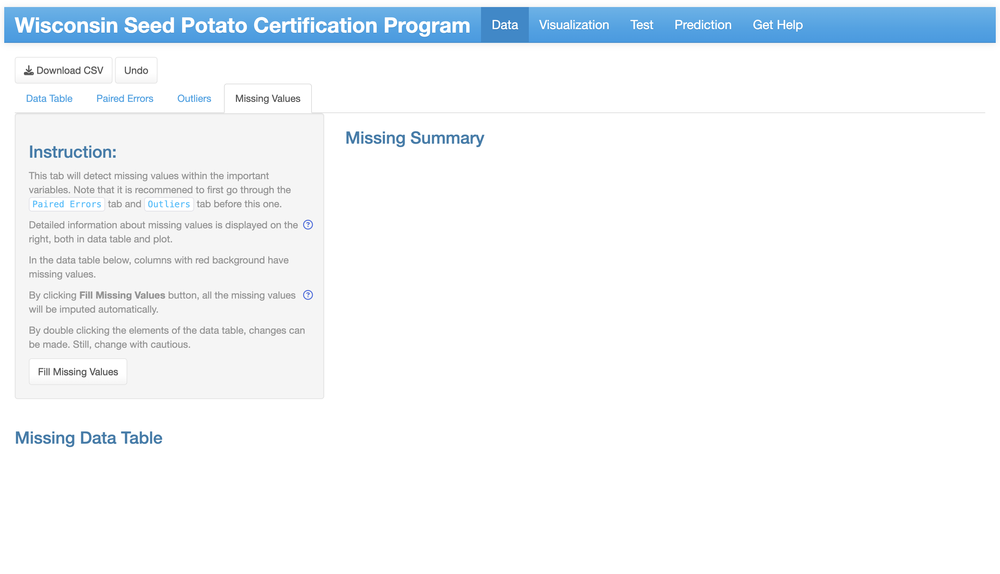
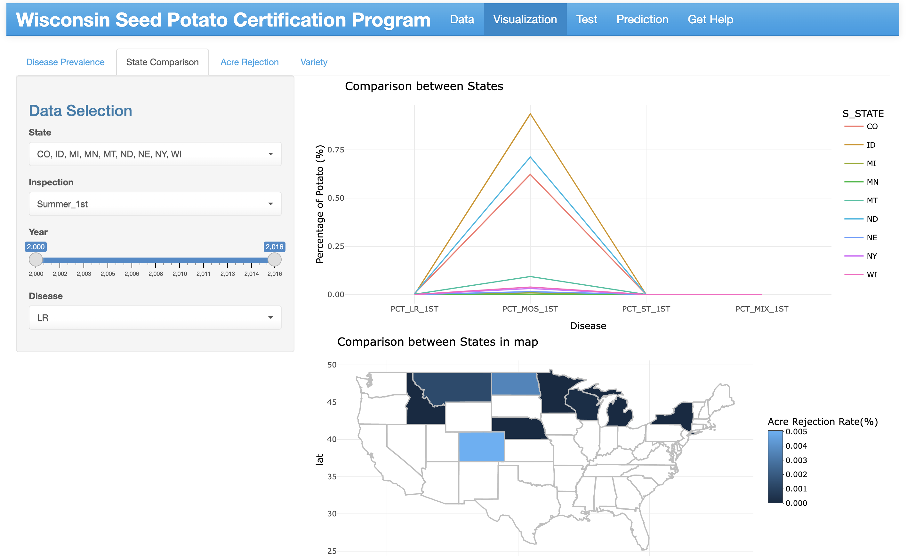
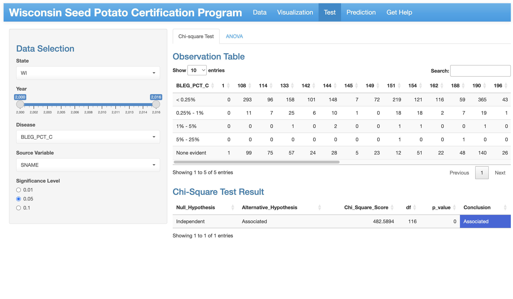
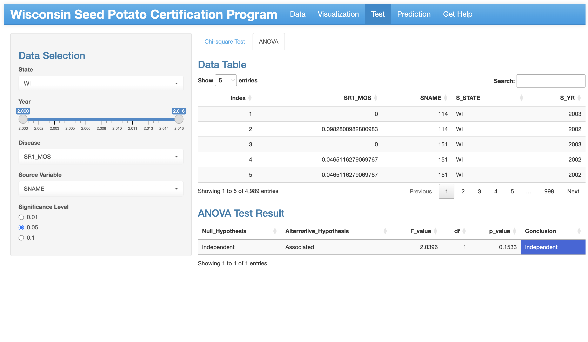

# Potato-Seed-Dashboard Documentation
`Potato-Seed-Dashboard` is an online bioinformatics tool for visualizing and analyzing the potato seed certification database. It contains five sections: 1) "Data" for data uploading validation, 2) "Visualization" for descriptive analysis, 3) "Test" for statistical test between variables, 4) "Prediction" for predicting possible infection rate in the future, and 5) "Get Help" for frequently asked questions.
We classify the data based on state, disease type, season and potato.

The following shows the hierarchy of the website:
- [Potato-Seed-Dashboard Documentation](#potato-seed-dashboard-documentation)
    - [Data Section](#data-import-section)
      - [Data Table](#data-table)
      - [Paired Errors](#paired-errors)
      - [Outliers](#outliers)
      - [Missing Values](#missing-values)
    - [Visualization Section](#data-visualization-section)
      - [Disease Prevalence](#disease-prevalence)
      - [State Comparison](#state-comparison)
      - [Acre Rejection](#acre-rejection)
      - [Variety](#variety)
    - [Test Section](#statistical-test)
      - [Chi-square Test](#chi-square-test)
      - [ANOVA](#anova)
    - [Predictioon Section](#prediction-section)
    - [Get Help](#get-help)
- [Feedback](#feedback)

## Data Section
* There are four subtabs within this tab:
  * Data Table
  * Paired Errors
  * Outliers
  * Missing Values
* There are two buttons:
  * Download CSV: Enables users to download the latest data set.
  * Undo: Cancel the last change users made to the data.
  
### Data Table
* It enables users to upload the data and to check the latest data table.
* There is only one file required, which should be a csv/xlsx file that contains seed potato certification data. It should have high quality, which means that there should be little missing or wrong values.
* If there are wrong column names or data type, a warning box will appear. Users can make changes to their data according to the information.

### Paired Errors
* This subtab will give error summary for the variables that are supposed to be the same in Summer and Winter.
* Users can first check "Paired Error Summary" table, which contains missing value and mismatch information.
* For the below two data tables, users can check detailed data table with "Paired Missing Values" or "Paired Mismatch" (which will change according to the selected variable). Values can be changed by double clicking elements in both data tables.
* The "Fill Missing Values" button can deal with missing values:
  * If a variable (column) have missing values and they are not paired, i.e. the corresponding values in the other season are not missing, they will be imputed by those values.
  * If there are paired continuous missing values, users can solve them in **Missing Values** subtab. If there are paired discrete missing values, the corresponding samples (rows) will be deleted.
* For the "Fix Mismatches" button, it will change the values in winter variables (columns) into the corresponding values in summer variables (columns).

### Outliers
* The **Outliers** subtab explores the possible outliers in the variables (columns) that are used in the later analysis, possibly caused by miss typing. 
* The "Outliers Box-Plot" will give the box plot of selected variables, and the "Detailed Data Table" will also change accordingly.
* Users may change the data set through the data table by double clicking the elements.
* It is recommended to check all the variables with care, as all of them should not be negative. Moreover, *PLTCT_1*, *PLTCT_2*, *winter_PLANTCT*, *ACRES* and *winter_ACRES* should be positive. All the values that violates the above principals will be marked with red background.

### Missing Values
* In this subtab, users can learn about the missing values within the variables (columns) that are important for the later analysis. 
* For "Missing Summary" part, users can check how many missing values are there for each variable (column) from the table, and the missing patterns from the plot.
* For "Missing Data Table", variables (columns) with missing values will have red background. Users can edit the data by double clicking elements of the data table. 
* Note that users can find missing values in the data table by clicking the variable (column) name to sort by it, and go to the end of the table.
* "Fill Missing Values" button will fill all the missing values with predicted mean matching.

## Visualization Section
* There are 4 kinds of visualization plots implemented in this section: 
    * Disease Prevalence
    * State Comparison
    * Acre Rejection
    * Variety
* Each analysis contains different visualizations showing potato health condition based on different classification criteria.
* For all the interactive visualization, users can click on the legend to filter out those they are not willing to show on the plots. Moreover, users can zoom in and out on the plots to see details. By hover on the plots, users can explore the detailed information or data.
    
                                                             
### Disease Prevalence
* The disease prevalence page contains 4 choices:
  * Inspection Season
  * Disease Type
  * State
  * Potato Variety
* After choosing the 4 elements above, it will generate a line plot. The x-axis is Year, and y-axis is Percentage of potato with the disease type you chose before.

### State Comparison
* The state comparison page contains 4 choices:
  * State
  * Inspection Season
  * Year
  * Disease Type
* After selecting the first 3 elements above, the plot on the top will be updated. It compares the average susceptibility in selected range of years of potato to different diseases in different states. Each line corresponds to a state, x-axis corresponds to disease types, and y-axis corresponds to percentage of infection.
* After choosing the Disease Type, users can check the map to compare certain disease infection rate between states. 

### Acre Rejection
* The acre rejection page contains two bar plots based on different classification criterias:
  * Potato Lot Name
  * Potato Variety
* The choices of *Potato Variety* will change according to the selection of the *Potato Lot Name*.
* The y-axis of each bar plot is Rejection Percentage (ACRE_REJ/ACRE_TOTAL). The x-axis is different potato lot name or potato variety. For each potato lot name/potato variety, it shows two bars -- one for summer and one for winter.

### Variety
* The variety page contains 4 choices:
  * Inspection Season
  * Disease Type
  * Potato Variety
  * Year
* After choosing the 4 elements above, it will generate a bar plot. The x-axis is different kinds of potato variety, and the y-axis is the average percentage of potato in the selected range of year with the selected disease type.

## Test Section
* The test page contains two types of methods:
  * Chi-square Test
  * ANOVA
* The first one is for diseases with discrete values, while the second one is for diseases with continuous values.
* There are 5 choices for the test page:
  * State
  * Year
  * Disease Type
  * Source Variable
  * Significance Level

### Chi-square Test
* The choices of "Disease Type" will keep those that have discrete values.
* After selecting the above choices, the dashboard will give an observation table, which will show the detailed distribution of the infection rate within the selected disease type over the selected variable.
* Also, the test result will be displayed in the below "Chi-Square Test Result" table:
  * Null_Hypothesis: The infection rate of selected disease type is independent with the selected variable.
  * Alternative_Hypothesis: They are associated.
  * Chi_Square_core: Test statistics.
  * df: Degree of freedom.
  * p_value: p-value of the test.
  * Conclusion: Independent or Associated based on the significance level selected.
* Note that if there is not enough degree of freedom to do the test, or if there is not enough sample to do the test, the table will give corresponding instructions.

### ANOVA
* The choices of "Disease Type" will keep those that have continuous values.
* After selecting the above choices, the dashboard will give a data table, which will show the data table containing variables (columns) of selected disease type, selected variable, state and year.
* Also, the test result will be displayed in the below "ANOVA Result" table:
  * Null_Hypothesis: The infection rate of selected disease type is independent with the selected variable.
  * Alternative_Hypothesis: They are associated.
  * F_value: Test statistics.
  * df: Degree of freedom.
  * p_value: p-value of the test.
  * Conclusion: Independent or Associated based on the significance level selected.
* Note that if there is not enough degree of freedom to do the test, or if there is not enough sample to do the test, the table will give corresponding instructions.

## Prediction Section
* The **Prediction** section has 4 choices:
  * Inspection Season
  * State
  * Disease Type
  * Potato Variety
* It gives prediction of disease prevalence after selecting the values of above variables. Users can see a plot with bars and points, indicating the predicted values.
* The predicting model is ARIMA. As the sample size is not big enough, the predicted results are for reference only, which means that they may vary from the true value. Thus, use the results with cautious.

## Get help
The FAQ Page contains questions and answers to common problems and doubts.

# Feedback
* Issues reports are encouraged through the [GitHub Issue Tracker](https://github.com/solislemuslab/bioklustering/issues).
* Feedback is always welcome via the following [Google Form](https://forms.gle/SUYQ6X3WNotpQphj6).

